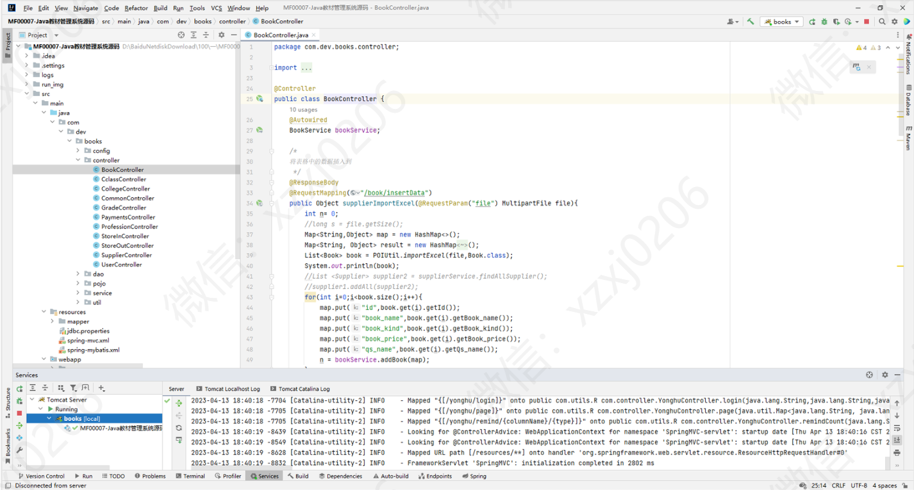
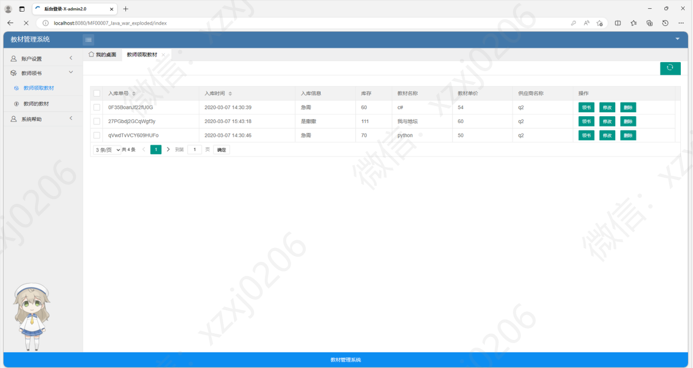

# 教材管理系统

### 有问题，或者需要协助调试运行项目的, 可以+扣扣：2529519551，或者+ wx ：xzxj0206  注明项目，“git+项目名称” ，如：“git学生宿舍管理系统”

## 一、介绍

基于spring+spring mvc+mybatis+layui+jquery+bootstrap的教材管理系统

## 二、系统运行界面

## 三、系统功能截图

### 1、管理员

### 2、教师

### 3、学生

